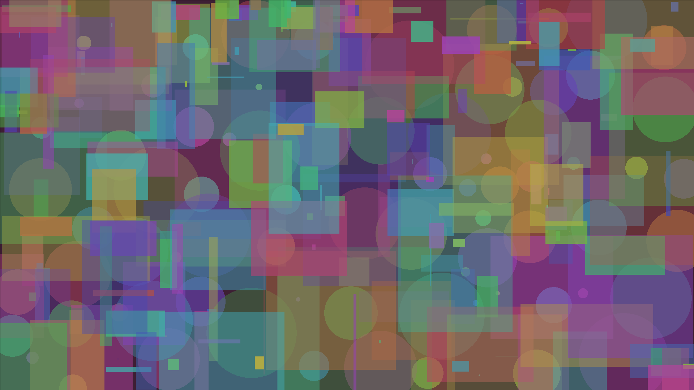

# The Joy of Abstract Art with Rob Boss



[Watch the full video performance!](https://youtu.be/f_mWTjxUbqk)

Prior to starting this project, I had little understanding or appreciation of abstract art. I grew up looking at these famous artists -- Picasso, Miro, Mondrian, etc. -- all of whom used shapes and colors as bases for their compositions. But although I enjoyed looking at these works on a certain level, I never really felt like I could relate to them personally.

Throughout my life, I have also been a big fan of Bob Ross. His soothing voice and carefree yet masterful approach to painting got me through a lot of hard times. After being recommended a Bob Ross episode on Youtube, I began wondering how a Bob Ross episode would play out in live digital formats (e.g. Zoom). Thus, *The Joy of Abstract Art with Rob Boss* is my take on how Bob Ross would teach abstract art over Zoom.

In preparation, I spent a large chunk of time researching not only how Bob Ross spoke about his painting process, but also how abstract artists went about creating their works. As it turns out, for many of these abstract artists, the process of creation plays a much larger role in the meaning of the works than the product, which made the Bob Ross show format unexpectedly suited for abstract art.

For the painting area, I initially had an implementation which relied on translating mouse drags/movements to lines -- similar to how MS Paint works. However, after some thought, I realized that having users draw lines would likely be detrimental to both the accessibility (e.g. trackpad users) and output quality. Since abstract art is generally a pretty "odd" concept in and of itself, I decided that trying to make the interface more accessible would be the better choice. To this end, I made clicking the primary mode of interaction, with each click creating circles/rectangles that animate for a sense of dynamics. The colors and sizes of each shape are picked algorithmically to serve as a reasonable compromise between user choice and output quality.

As final touches, I added an intro/closing "slide" and color tickers, all of which are present in the original *Joy of Painting* show.

## Usage

Requires OpenFrameworks.

```
make && make run
```
